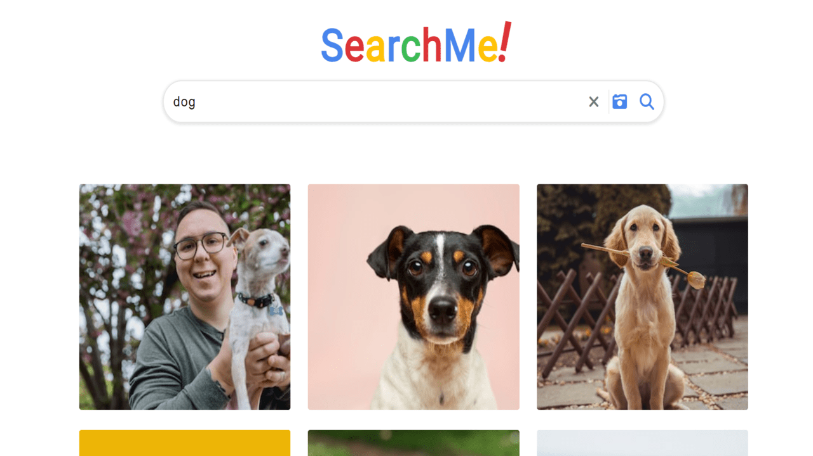

# Search-App using Wikipedia and Unsplash APIs

## Project Overview

This is a fully functional and fully responsive web application that utilizes two external APIs, Wikipedia and Unsplash, to enhance data search capabilities and enrich search results with images.

The primary goal of this project was to gain hands-on experience with external APIs, data fetching, and creating a more functional user experience by integrating data from multiple sources.

### Key Features

- Search for information using Wikipedia API
- Enhance search results with relevant images from Unsplash API
- Fully responsive design for seamless user experience on various devices

## Getting Started

Follow the steps below to get the project up and running on your local machine:

1. Clone this repository: `git clone https://github.com/drstrangelove193/my-search-app.git`
2. Navigate to the project directory: `cd my-search-app/src`
3. Run it on your local development server.

## APIs Used

- Wikipedia API: Used for retrieving information based on search queries.
- Unsplash API: Integrated to provide visually appealing images alongside search results.

## Project Insight

I was inspired by a tutorial by Dave Gray (link: https://www.youtube.com/watch?v=Dk6Wopar10k) to build this application. While the tutorial covered the Wikipedia API, I decided to take it further by integrating the Unsplash API to provide a more immersive user experience.

## Deployment

The application was deployed using Netlify. To ensure the security of my API access key, I utilized Netlify's serverless functions, which allowed me to hide sensitive information from public access.

## Lessons Learned

This project provided valuable insights into working with APIs and offered a rewarding opportunity to further refine my expertise in CSS, particularly in SASS and SCSS.

## Future Enhancements

In the future, I plan to implement additional features such as advanced search filters, bookmarking, and personalized user preferences.

## Contact

For questions or feedback, please reach out to me at giorgioragvelidze1@gmail.com

